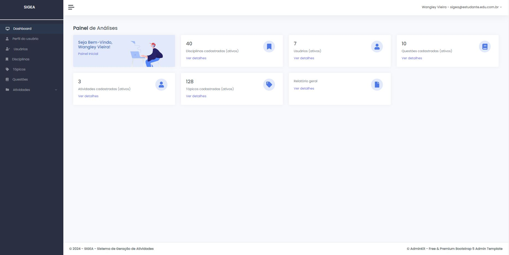

## Sobre o SIGEA (SISTEMA DE GERAÇÃO DE ATIVIDADES)
Desenvolvimento do sistema web SIGEA - Sistema de Geração de Atividades do curso Superior de Tecnologia em Sistemas para Internet do IFMS. No SIGEA os docentes podem cadastrar e compartilhar as questões no sistema de acordo com a disciplina e os tópicos relacionados no PPC (Projeto Pedagógico do Curso), e também as atividades vinculadas a uma disciplina. O sistema oferece a geração de PDFs para as atividades, além de diversos relatórios de gestão para o administrador do sistema. A implementação do sistema se dá através da Linguagem de Programação PHP junto com o Framework Laravel e com o Banco de Dados Relacional PostgreSQL.

## Tela de Login

## Dashboard administrador

